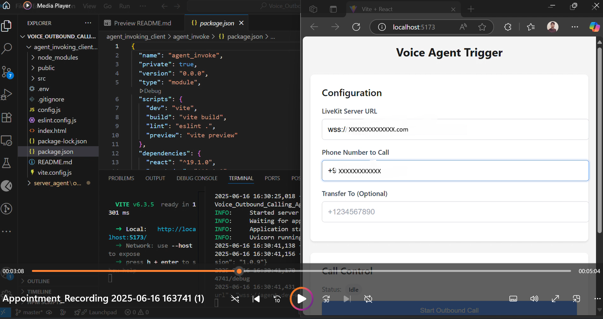

# LiveKit Outbound Calling Agent (React + Python)

This project enables a full-stack outbound calling system using **LiveKit Agents**, **FastAPI**, and a **React dashboard**.

The voice agent:
- Makes SIP-based outbound calls (e.g., appointment reminders).
- Uses STT, TTS, and LLMs for intelligent conversations.
- Provides real-time WebSocket-based monitoring.


**Sample Application Image**



---

## 📁 Project Structure

```

Voice\_Outbound\_Calling\_Agent/
├── agent\_invoking\_client/        # React App for Admin UI
│   └── agent\_invoke/
│       ├── src/                  # Contains React components
│       ├── config.js             # LiveKit client configs
│       └── ...
└── server\_agent/                 # Python FastAPI + LiveKit Agent
└── outbound-caller-python-main/
├── app.py                # FastAPI server
├── agent.py              # LiveKit agent logic
├── log\_streamer.py       # WebSocket log handler
├── requirements.txt
└── ...

````

---

## Requirements

- Python 3.10+
- `lk` CLI installed (LiveKit CLI)

### Backend Setup (FastAPI)
```bash
cd server_agent/outbound-caller-python-main
cp .env.example .env  # Or manually create a .env file
pip install -r requirements.txt
python app.py dev
```


### Frontend
- Node.js v18+
- npm or yarn

### Frontend Setup (React)
```bash
cd agent_invoke
npm run dev
```


---

## 🛠 Environment Setup

Create `.env.local` under `server_agent/outbound-caller-python-main`:

```env
LIVEKIT_URL=https://your-livekit-server
LIVEKIT_API_KEY=your_key
LIVEKIT_API_SECRET=your_secret

SIP_OUTBOUND_TRUNK_ID=sip-trunk-id

ASSEMBLYAI_API_KEY=your_assembly_key
GOOGLE_API_KEY=your_google_key
ELEVENLABS_API_KEY=your_elevenlabs_key
````

Create `.env` under `agent_invoking_client/agent_invoke` for React:

```env
REACT_APP_LIVEKIT_URL=https://your-livekit-server
REACT_APP_LIVEKIT_TOKEN=your_temporary_token_or_use_dynamic
```

> 💡 **Note:** In production, generate LiveKit tokens securely on the backend.

---

## 🚀 Getting Started

### Backend (FastAPI + Agent)

```bash
cd server_agent/outbound-caller-python-main
pip install -r requirements.txt
python app.py dev
```

* Starts FastAPI on `http://localhost:8000`
* Launches outbound agent `outbound-caller`

---

### Frontend (React Dashboard)

```bash
cd agent_invoking_client/agent_invoke
npm install
npm run dev
```

* Starts React on `http://localhost:3000`
* Admin UI for triggering and monitoring calls

---

## 🔁 Outbound Call Flow

1. Admin inputs number and triggers call from React dashboard.
2. React sends POST to `/dispatch` API (FastAPI).
3. FastAPI executes `lk dispatch create` to summon the `outbound-caller` agent.
4. Agent joins the LiveKit room and makes a SIP call.
5. Transcript and logs are streamed via WebSocket and shown on UI.

---

## 💬 Sample API Usage

### Dispatch via FastAPI

```http
POST http://localhost:8000/dispatch
Content-Type: application/json

{
  "room_name": "outbound-room-01",
  "agent_name": "outbound-caller",
  "phone_number": "+911234567890",
  "transfer_to": "+919876543210"
}
```

Response:

```json
{
  "status": "success",
  "stdout": "Dispatch created successfully"
}
```

---

## 📺 Real-Time Monitoring

* Transcript is displayed in real-time on the frontend.
* Logs sent via WebSocket from backend at:

```
ws://localhost:8000/ws/logs
```

---

## ✨ Features

✅ Outbound SIP call via LiveKit
✅ Real-time transcript with speaker info
✅ Google Gemini + AssemblyAI + ElevenLabs integration
✅ Call routing to human transfer
✅ Frontend dashboard to monitor calls

---

## 🧠 Tech Stack

| Layer    | Tech Used               |
| -------- | ----------------------- |
| Backend  | FastAPI, Python         |
| Frontend | React + Vite + Tailwind |
| Agent    | LiveKit Agent SDK       |
| STT      | AssemblyAI              |
| TTS      | ElevenLabs              |
| LLM      | Google Gemini           |
| Call     | Twilio SIP + LiveKit    |

---

## 🤝 Acknowledgements

* [LiveKit Agents](https://docs.livekit.io/agents/)
* [AssemblyAI](https://www.assemblyai.com/)
* [ElevenLabs](https://www.elevenlabs.io/)
* [Google Gemini](https://ai.google.dev/)

---

> Made with ❤️ by Devendra Maharshi
